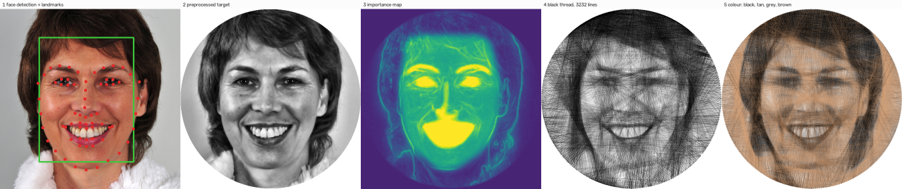

# Computational string art with OpenCV

Turn a photo into **string art**: one continuous thread wound between pins on a circular
frame, or one thread per colour. The pipeline crops to the face, weights the important
features, picks every line with a physically modelled self-stopping solver, refines the path,
and produces a simulated render, a thread-by-thread animation and a build kit for a real
piece.


*Face detection and landmarks → preprocessed target → importance map → black thread (3,232
lines, 300 pins) → four colours.*

## Results at a glance
Simulated, 600 px canvas, 256 pins, 30 openly licensed test images.

| | result |
|---|---|
| Our solver vs the prior greedy method, equal line count | better SSIM (viewing blur σ = 2) on **29/30** images, about half the time |
| Full pipeline, face region | face SSIM up on **22/22** face images |
| Path refinement (2 sweeps) | +0.011 SSIM on 24/30, +0.015 face SSIM on 21/22 |
| Badly exposed photos (held-out set) | recovered to 0.650 SSIM vs 0.657 for the clean photo; no false alarms on 12 photos |
| Colour vs the prior dither method | CIEDE2000 **−5.0**, luminance SSIM +0.15, on 12/12 images |

## Where to go

| | |
|---|---|
| **[User guide](guide.md)** | setup, the web demo, sample images, every command and argument |
| **[Project report](report/report.md)** | method, experiments, results, limitations |
| **[Build guide](BUILD_GUIDE.md)** | turning a design into a real piece: template, calibration, winding |
| **[Milestone log](milestones/README.md)** | what was built at each step, with results and findings |
| **[Credits](credits.md)** | photo authors and licences |

## Try it

```sh
uv sync --extra demo
uv run stringart fetch-models
uv run stringart run sample:woman_smiling      # → outputs/woman_smiling_greedy/render.png
uv run --extra demo stringart demo             # web demo at http://127.0.0.1:7860
```

Or use the browser version: the Streamlit app, described in
[the online version](guide.md#the-online-version-streamlit).

*20XW97 project · Ajay H (22PW01) · Prem Dharshan D (22PW29)*
