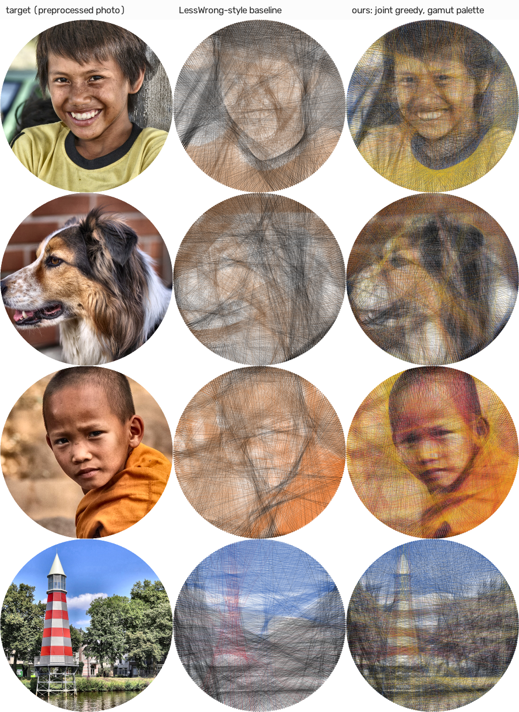

# M5: Colour string art (I7)

**Status:** done · **Commit:** see the milestone log

## Goal
Deliver the colour extension promised in the project abstract (k-means palette, dithering),
and do better than the prior colour method rather than just reproducing it.

## Method (`color.py`)
- **Thread model.** A thread of colour *c* is composited *over* what is beneath it, per RGB
  channel: `C ← C(1 − a) + c·a` with `a = opacity × coverage`. For black thread on a white
  board this is exactly the grayscale model, and a test confirms that a black-only palette
  reproduces the grayscale solver's pin sequence exactly.
- **Palette.** k-means (`cv2.kmeans`) in CIELAB on the image. Each centre is snapped to the
  nearest real thread colour from a 16-colour sewing/embroidery list. Black is always
  included; white never is (the board supplies white). `--palette black,red,tan,…` overrides.
- **Joint colour greedy (ours).** Each colour is its own physical thread with its own current
  pin. Each step takes the (colour, line) pair that most reduces the importance-weighted
  squared RGB error, and stops when nothing helps. Once a colour is chosen it is kept for at
  least `min_run = 100` lines, so the builder switches spools a few dozen times instead of
  every line. Render order equals build order, so "over" compositing matches how the threads
  physically layer.
- **Baseline (LessWrong-style).** Floyd–Steinberg dithering into palette + white, an
  independent greedy per colour on its blurred dither mask, layered light → dark.
- **Fabrication.** `instructions.txt` lists, per spool, its line count, thread length and
  tie-on pin, then the global winding order in colour runs.
- **Visualizer and CLI.** `viz.Source` replays grayscale or colour results through the same
  renderers. `stringart run img --colors 4` (or `--palette …`) and `stringart viz` work for
  colour.

## Results
From `experiments/evaluate_color.py`: 12 colourful images (faces, the veiled face, dogs, cat,
lighthouse), 4 threads, 256 pins, opacity 0.2. Metrics are against the colour target after
viewing blur. ΔE2000: lower is better. Luminance SSIM: higher is better.

| method | ΔE2000 σ2 | ΔE2000 σ4 | lum SSIM σ2 | lum SSIM σ4 | lines | spool switches | time s |
|---|---|---|---|---|---|---|---|
| LessWrong-style baseline | 16.36 | 15.55 | 0.503 | 0.668 | 4067 | 3 | 2.0 |
| **joint colour greedy** | **12.59** | **11.81** | 0.662 | 0.801 | 5782 | 39 | 8.8 |
| joint, RGB palette | 12.92 | 12.14 | **0.670** | **0.808** | 6132 | 43 | 8.6 |
| joint, no spool limit (min_run 1) | 12.67 | 11.88 | 0.656 | 0.798 | 5558 | 144 | 16.6 |
| black only (grayscale method) | 16.00 | 15.33 | 0.602 | 0.792 | 3012 | 0 | 2.3 |

| comparison | Δ ΔE2000 σ2 | wins | Δ lum SSIM σ2 | wins |
|---|---|---|---|---|
| joint − LessWrong-style baseline | **−3.77** | **12 / 12** | **+0.159** | **12 / 12** |
| joint − black only | −3.41 | 10 / 12 | +0.060 | 10 / 12 |
| min_run 100 − min_run 1 | −0.07 | 5 / 12 | +0.006 | 8 / 12 |
| Lab palette − RGB palette | −0.33 | 5 / 12 | −0.008 | 2 / 12 |



*Photos: see [data/ATTRIBUTION.md](../../data/ATTRIBUTION.md); derivative figure under the
same licences.*

## Findings
1. **Joint colour greedy clearly beats the prior colour method** on every image, in both
   colour accuracy (ΔE −3.8) and structure (luminance SSIM +0.16). The baseline's per-colour
   solves can't see each other, so colours over-paint one another and the structure washes
   out. In the gallery, the faces and the dog are recognizable only in the joint result.
   (The joint solver also uses importance weights; the baseline, as published, doesn't.)
2. **Colour adds real information over black thread** (ΔE −3.4 on 10/12 images, luminance
   SSIM +0.06), at about 2× the lines and thread.
3. **The spool-switch limit is free.** Requiring at least 100 lines per colour run gives the
   same quality as unconstrained switching, with 4× fewer switches (39 vs 144) and half the
   time, which makes the build practical.
4. **Lab vs RGB palette: no clear winner.** Three images get the same palette either way. Of
   the 9 that differ, Lab wins 5 and RGB 4. *Which* thread colours end up in the palette
   matters more than the clustering space. For the boy, neither palette contains yellow, so
   his yellow shirt is rendered in tan. Choosing threads by their effect on the final error,
   rather than snapping k-means centres, is a natural next step.
5. **Cost:** colour runs take about 9 s (vs about 1 s for black greedy) and use about 2× the
   thread. Refinement (M4) is grayscale-only for now.

> **Revised in M8:** the default palette is now chosen by *reachable gamut* rather than by
> snapping k-means centres: ΔE2000 11.34 vs 12.56 here (−5.0 vs the LessWrong-style baseline,
> 12/12), confirmed on the held-out set (11.14 vs 12.59, 11/12), at a small cost in luminance
> SSIM. The boy's palette now includes yellow (ΔE 12.2 → 10.4). See
> [M8](M8-hardening.md#3-palette-by-reachable-gamut-colorfit_palette).

## Tests
9 colour tests:
- black thread = the grayscale renderer
- black-only palette = the grayscale solver, identical sequence
- colour gains equal the error drop of the render (rel 1e-6)
- `min_run` is respected
- palette finds the dominant colours
- dithering proportions
- the baseline layers light → dark
- metrics identity
- unknown thread names are rejected

Plus colour visualizer, export and grid tests, and a CLI colour round trip.

## Reproduce
```sh
uv run python experiments/evaluate_color.py      # ~12 min
uv run python experiments/figures_m5.py --docs
uv run stringart run photo.jpg --colors 4 --frame-mm 700 --pins 300
uv run stringart run photo.jpg --palette black,tan,brown,red
```
