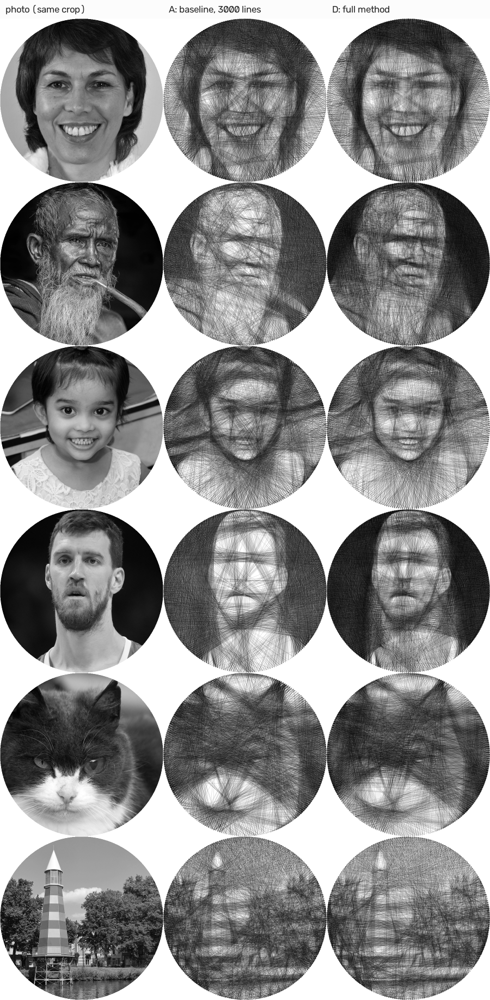
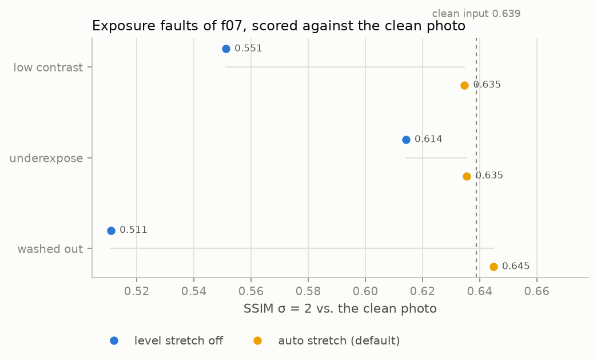
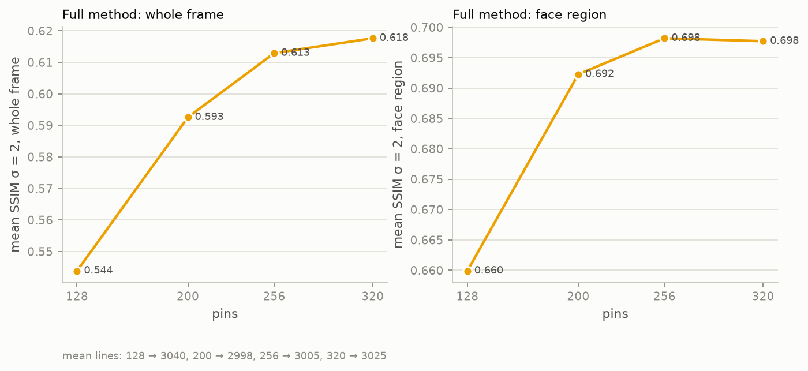
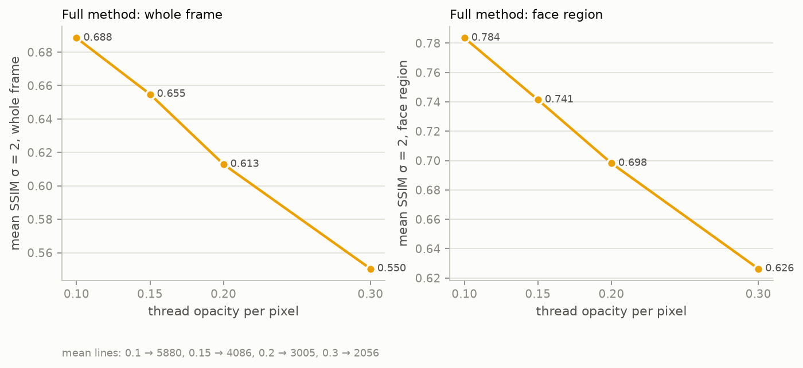

# M6: Dataset, evaluation and fabrication output

**Status:** done · **Commit:** see the milestone log

## Goal
Test the method on a real, diverse image set without per-image tuning. Measure every design
choice against the prior-art baseline, with a protocol that compares like with like. Produce a
buildable output.

## Dataset (`data/dataset.json`, `experiments/fetch_dataset.py`)
30 images: 27 from Wikimedia Commons (public domain, CC0, CC BY, CC BY-SA) plus 3 synthetic
variants. Attribution for every image is in [`data/ATTRIBUTION.md`](../../data/ATTRIBUTION.md).
The images themselves are downloaded into the gitignored `data/raw/`.

| category | n | content |
|---|---|---|
| face | 17 | Men, women, children, older people; several skin tones; glasses and beards; studio and busy backgrounds; three-quarter and tilted poses; 3 black-and-white; low-key; small faces in full-body shots |
| hard | 4 | Face mostly covered by a veil (h01), plus synthetic **underexposed / low-contrast / washed-out** variants of f07 (h02–h04), which have a known clean original |
| animal | 7 | 3 dogs, 4 cats (fur texture, low-key, high contrast) |
| object | 2 | Lighthouses: one busy scene, one white-on-white low contrast |

**Curation.** Candidates came from Commons "Quality images" categories (men, women,
children, dogs, cats, lighthouses) and "Featured pictures of people". Portraits were
pre-filtered automatically: exactly one YuNet face, score > 0.85, face height ≥ 15 % of the
image. The final set was then picked by hand for diversity. YuNet finds a face in all 21 face
and hard images, and also, as a false positive, on the fluffy dog (a01). That one is harmless,
since it lands on the dog's face.

## Protocol (`experiments/evaluate_dataset.py`)

| id | method |
|---|---|
| **A** | Baseline as published (Vrellis / LessWrong greedy, M1 filters), fixed 3,000 lines, line_strength 0.1 |
| **B** | Same baseline at the line count C chose (controls for line count) |
| **C** | M2 greedy solver with M1 filters (solver improvement only) |
| **D** | Full method: M3 filters (auto level stretch, bilateral, CLAHE) + auto importance + M2 solver |

- **Same framing for all four methods.** The face-centred crop is applied to every method,
  so each is scored against the same picture. The first attempt framed D differently from
  A–C, which compared different pictures, and was discarded. The framing effect is reported
  separately.
- **Metrics:** SSIM / PSNR after Gaussian blur σ = 2 and 4 px (viewing distance), measured
  against the plain grayscale photo inside the frame. Face SSIM uses the landmark face oval.
- **Synthetic faults (h02–h04)** are scored against the *clean* original. Scoring against the
  degraded input would count fixing the exposure as an error; the first run did exactly that.
- **Fixed settings:** 600 px canvas, 256 pins, opacity 0.2, min gap 10. No per-image tuning.

## Results

### Main comparison (mean over images)


| method | SSIM σ2, all 30 | SSIM σ4, all 30 | PSNR σ2, all 30 | face SSIM σ2, 21 face+hard | lines | time s |
|---|---|---|---|---|---|---|
| A baseline, 3000 lines | 0.616 | 0.800 | 17.29 | 0.642 | 3000 | 8.9 |
| B baseline, equal lines | 0.624 | 0.806 | 18.14 | 0.628 | 2793 | 8.5 |
| C greedy solver | **0.643** | **0.822** | 18.66 | 0.633 | 2793 | **4.7** |
| D full method | 0.634 | 0.818 | **18.83** | **0.690** | 2778 | **4.6** |

Paired, per image:

| comparison | Δ SSIM σ2 (whole frame) | wins | Δ face SSIM σ2 | wins |
|---|---|---|---|---|
| C − B (solver, equal lines) | **+0.019** | **29 / 30** | +0.005 | 15 / 22 |
| C − A (solver vs published baseline) | +0.028 | 21 / 30 | −0.009 | 8 / 22 |
| D − C (preprocessing + importance) | −0.010 | 9 / 30 | **+0.057** | **22 / 22** |
| D − A (whole method vs published baseline) | +0.018 | 14 / 30 | **+0.048** | **20 / 22** |



*Gallery rows: f07, f16, f13, f05, a04, o01. Photos by the authors listed in
[data/ATTRIBUTION.md](../../data/ATTRIBUTION.md) (CC BY-SA 3.0 de / 4.0, CC0, CC BY 4.0); the
figure is a derivative work shared under the same licences.*

### Robustness to exposure faults (vs. the clean photo)


| input | auto stretch | stretch off |
|---|---|---|
| clean f07 (reference) | 0.639 | |
| underexposed (h02) | **0.661** | 0.614 |
| low contrast (h03) | **0.623** | 0.551 |
| washed out (h04) | **0.548** | 0.511 |

### SSIM vs. number of lines


| image | greedy peak (lines) | baseline peak (lines) | greedy auto-stop |
|---|---|---|---|
| f07 woman | **0.647** (3250) | 0.620 (4250) | 2972 |
| f16 elderly man | **0.652** (6000, still rising) | 0.532 (5750) | 4418 |
| a06 tabby cat | 0.623 (3000) | **0.634** (3750) | 2843 |
| o01 lighthouse | 0.634 (3000) | **0.651** (3750) | 2626 |

### Pins and thread opacity (full method, 5-face subset)



| pins | 128 | 200 | **256** | 320 |
|---|---|---|---|---|
| SSIM σ2 | 0.544 | 0.593 | 0.613 | 0.618 |
| face SSIM σ2 | 0.660 | 0.692 | 0.698 | 0.698 |
| time s | 2.6 | 4.1 | 5.0 | 7.0 |

| opacity | 0.1 | 0.15 | **0.2** | 0.3 |
|---|---|---|---|---|
| SSIM σ2 | **0.688** | 0.655 | 0.613 | 0.550 |
| face SSIM σ2 | **0.784** | 0.741 | 0.698 | 0.626 |
| lines | 5880 | 4086 | 3005 | 2056 |

## Findings
1. **The solver is a consistent win.** At an equal line count it beats the baseline on
   **29/30 images** (+0.019 SSIM σ2) at about half the run time (4.7 s vs 8.5–8.9 s). It
   needs no line count or line-strength tuning.
2. **Preprocessing and importance do what they were designed to do.** Face SSIM goes up on
   **22/22** face and hard images (+0.057 over the solver alone, +0.048 over the published
   baseline). Whole-frame SSIM drops slightly (−0.010), because importance pulls threads
   from the background into the face. That trade is intended for portraits. On animals and
   objects (no face, so uniform weights) D ≈ C.
3. **Exposure robustness.** The auto level stretch recovers all three synthetic faults
   (+0.037 to +0.072 SSIM). On the underexposed input it even slightly exceeds the clean
   result. The washed-out case recovers only partially (0.548 vs 0.639), because a gamma
   shift needs a gamma correction, not a level stretch. An earlier, range-only trigger missed
   two of the three faults. The final rule (narrow range, *or* no black point, *or* no white
   point) fires on all 3 faults and on none of the 27 natural photos. **Caveat:** those
   thresholds were chosen by looking at this set.
4. **The automatic stop is MSE-optimal, not SSIM-optimal.** In 3/4 curves the auto-stop lands
   within about 250–400 lines of greedy's SSIM peak. On the high-detail f16, SSIM is still
   rising at 6000 lines while the stop is at 4418. The greedy degrades gracefully past its
   stop, whereas the baseline collapses (lighthouse: 0.651 → 0.54 by 6000 lines).
5. **With the line count picked by hand per image, the baseline can win on textured,
   face-less images** under SSIM (cat +0.011, lighthouse +0.017). That choice requires seeing
   the result, which a user can't do in advance, and on faces the greedy wins by a wide margin
   (+0.027, +0.120).
6. **Thread is the biggest physical lever.** Halving the opacity (thinner thread relative to
   the frame) gives +0.075 SSIM and +0.086 face SSIM, at about 2× the lines. More pins
   saturate after about 256 (+0.005 for 320 pins, at 1.4× the time).
7. **Framing:** the face-centred crop raises the face's share of the canvas from 25.9 % to
   31.0 % on this set. The gain is smaller than on the sample images, because these photos
   are mostly portraits already.
8. **Known outlier:** baseline A on the washed-out h04 scores well (0.614) by accident. Its
   fixed 3,000 lines over-darken, which happens to offset the washed-out exposure.

> **Re-run in M8 (Docker, with gamma-aware exposure):** only the three synthetic faults
> change. Full method on hard cases: SSIM σ2 0.618 → **0.639**, face SSIM 0.678 → 0.692.
> Paired: D − A +0.021 (15/30), face **+0.051 (21/22)**; D − C −0.007 (9/30), face
> **+0.060 (22/22)**. Robustness with stretch + gamma, vs the clean photo (0.639): underexposed
> 0.636, low contrast 0.635, washed out **0.645** (was 0.548). The thresholds were then checked
> on a rule-chosen held-out set (M8).

## Fabrication output
`stringart run … --frame-mm 500` now also writes `instructions.txt`, a numbered winding list
in 100-line blocks with running thread length, and records `thread_length_m` in
`metrics.json`. Pins are numbered clockwise from the top. Thread length is reported in metres
when the frame size is given, else in frame widths.

## Limitations and next steps
- Only one physical opacity calibration is assumed. A small test build is needed to fit
  `opacity` (thread width / pixel) to real thread.
- No gamma correction for washed-out inputs (finding 3).
- The stop rule could target perceptual error (the blur objective from M2, or an SSIM-aware
  stop) instead of MSE.
- 30 images, 2 objects: the object category is too small for conclusions.
- M4 (remove/swap refinement) and M5 (colour) are not started.

## Reproduce
```sh
uv run stringart fetch-models
uv run python experiments/fetch_dataset.py
uv run python experiments/evaluate_dataset.py         # ~25 min; writes outputs/experiments/m6/
uv run python experiments/figures_m6.py --docs
```
