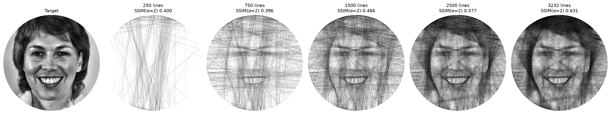
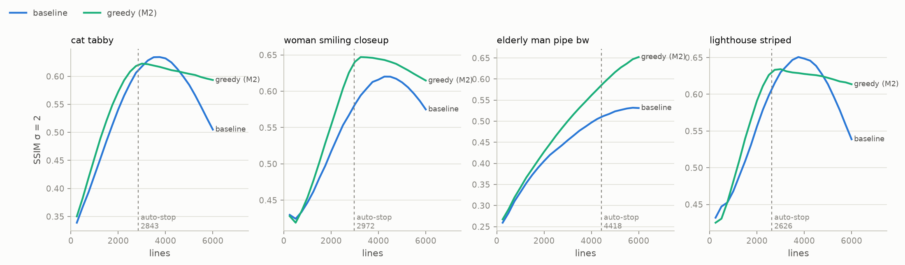
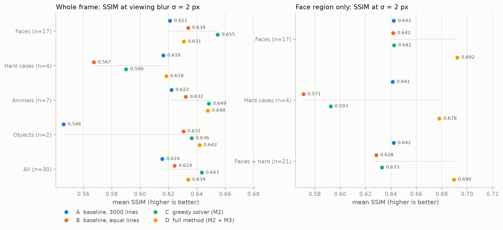

# A Computer Vision Approach to String Art

**Robust, fast and buildable thread portraits with an OpenCV pipeline**

Ajay H (22PW01) · Prem Dharshan D (22PW29)
20XW97 Package · October 2026
Code: <https://github.com/Prem-Dharshan/string-art>

---

## Abstract
String art builds an image from a single thread wound between pins on a frame. We present a
computer-vision pipeline that turns a photograph into a pin sequence a person can wind on a
real frame.

**Preprocessing (OpenCV).**
- YuNet face detection centres the frame on the face.
- An automatic level stretch is applied only to badly exposed photos.
- Edge-preserving bilateral smoothing and CLAHE follow.
- LBF facial landmarks, Scharr edges and spectral-residual saliency form an importance map.

**Solver.** It optimizes a physical thread model: each thread covers a fraction of a pixel,
set by the real thread width and frame size, and overlapping threads compose
multiplicatively. A greedy search scores every candidate line by its exact drop in
importance-weighted error and stops by itself. A path-refinement step (delete, reroute and
insert pins) then improves the sequence without ever increasing the error and without breaking
the single continuous thread. Candidate scoring runs in parallel. The same model extends to
coloured threads: a joint greedy picks the best (colour, line) pair, with a palette from
k-means in CIELAB.

**Results.** On 30 openly licensed images (faces, hard cases, animals, objects), our solver
beats the prior greedy method on 29 of 30 images at an equal line count, in about half the
time. The full pipeline raises face-region SSIM on all 22 face images. Automatic exposure
handling recovers synthetic under-, low-contrast and over-exposure faults. In colour, our joint
solver beats the prior dither-based approach on all 12 colourful test images (CIEDE2000 −3.8,
luminance SSIM +0.16). The system outputs a numbered winding list with thread lengths and a
thread-by-thread visualization, and ships as a command-line tool and a local web demo.

---

## 1. Introduction
Computational string art, popularized by Petros Vrellis, approximates an image with straight
chords of thread between pins on a circular frame. A full piece uses thousands of lines and
kilometres of thread. Because a line, once wound, darkens everything it crosses, choosing
lines is a combinatorial optimization over a continuous path.

The common open method is a greedy loop: from the current pin, take the line through the
darkest remaining pixels, subtract a constant darkness along it, and repeat. It is simple but
has well-known weaknesses:
- the line darkness is an arbitrary constant
- the number of lines must be guessed, and too many lines over-darken the image
- faces, the usual subject, come out murky unless important regions are masked by hand
- the colour variant optimizes each colour independently

**Contributions.** Every number below is measured in §6.
1. **Physical, self-stopping solver.** The solver optimizes the image that is actually drawn,
   under a multiplicative thread model whose opacity comes from thread width and frame size.
   It stops when no line helps, and is 4× faster than our serial version through parallel
   candidate scoring. *It beats the prior greedy method on 29/30 images at an equal line
   count.*
2. **Face-aware OpenCV preprocessing and automatic importance maps.** No manual masks and no
   per-image tuning. *Face-region SSIM rises on 22/22 face images.*
3. **Path refinement.** Delete, reroute and insert moves keep one continuous thread and never
   increase the error. *+0.010 SSIM σ2 (23/30) and +0.015 face SSIM (21/22).*
4. **Joint colour solver** with per-colour threads and a practical spool-switching limit.
   *CIEDE2000 −3.8 vs the prior colour method on 12/12 images.*
5. **A buildable output and an evaluation protocol.** A winding list with thread lengths for
   the team's 700 mm, 300-pin frame, a visualizer, a web demo, a 30-image openly licensed
   benchmark, and a protocol that compares methods on identical framing.

## 2. Related work
- **Vrellis-style greedy and "Computational Thread Art" (LessWrong).** Lines are chosen
  greedily by mean darkness, with a penalty using ± importance weights and a darkness term.
  Colour is handled by Floyd–Steinberg dithering into one image per colour, solved
  separately and layered. Precomputed line coordinates and numpy brought runtime to about
  10 s. This is our main baseline (§5).
- **Birsak et al., "String Art: Towards Computational Fabrication of String Images"
  (Computer Graphics Forum, 2018).** Compares a fine canvas with a coarse target to model
  viewing distance, with an add/remove optimization and importance maps. It is more
  principled but computationally heavy. We adopt its viewing-distance view in a cheap form:
  the thread's fractional coverage of a canvas pixel, and evaluation after blur.
- **"Automated String Art Creation" (IEEE Xplore 10844087).** Focuses on fabrication (CNC,
  3D printing, Arduino thread tensioning) and a CNN for image processing. We use it as
  fabrication context; our output targets manual or machine winding equally.

## 3. Method


*Figure 1. The pipeline on one photo: (1) YuNet face box and 68 LBF landmarks; (2)
preprocessed target; (3) automatic importance map; (4) black-thread result, 3,232 lines,
300 pins; (5) four-colour result.*

### 3.1 Preprocessing
1. **Face-centred crop.** YuNet (OpenCV `FaceDetectorYN`, 0.2 MB ONNX) finds faces. The square
   crop has side 1.8 × the face height, is shifted slightly downward and clamped to the image.
   Without a face, a centre crop is used.
2. **Automatic exposure.** A 1–99 percentile level stretch is applied only when the photo is
   badly exposed: narrow range (p99 − p1 < 115/255), no black point (p1 > 64) or no white
   point (p99 < 128). Stretching well-exposed photos hurt fidelity (M3), so it is not applied
   unconditionally.
3. **Edge-preserving smoothing** (`cv2.bilateralFilter`) and **CLAHE** (local contrast).
4. *(Optional)* **GrabCut background fade**, seeded from the face. This is an aesthetic
   option and off by default (§7).

### 3.2 Importance maps
`W = floor + (1 − floor) · clip(1.0·face + 0.5·edges + 0.25·saliency)`, with floor 0.1.

- **Face term:** the 68 LBF landmarks (OpenCV `Facemark`) give a face oval (0.5) and the eyes,
  brows, nose and mouth (1.0), feathered with a Gaussian. With only YuNet's five points,
  ellipses and discs are used instead.
- **Edges:** Scharr gradient magnitude normalized at its 99th percentile, excluding the
  artificial edge at the frame rim.
- **Saliency:** OpenCV spectral-residual saliency.

Weights are applied **automatically only when a face is found**; on face-less images they
did not help (§6.2). Our error is symmetric, so high weights on light features (eye whites,
teeth) also keep stray threads off them, which does the job of LessWrong's hand-drawn negative
weights.

### 3.3 Thread model and objective
- **Coverage.** A thread covers pixel *p* with alpha `a = opacity · coverage_p`, where
  coverage comes from a Xiaolin-Wu anti-aliased line and `opacity = thread width / pixel
  size`. For a 0.25 mm thread on a 700 mm frame at 600 px, opacity ≈ 0.21.
- **Composition.** Threads compose multiplicatively, `d ← d + a(1 − d)`, so darkness never
  exceeds 1. The renderer, the visualizer and the solver share this exact model.
- **Objective.** Minimize `E = Σ_p W_p (t_p − d_p)²` against target darkness *t*.
- **Viewing distance.** Because a thread covers only part of a pixel, the canvas resolution
  itself acts as the viewing-distance model. All evaluation is also reported after Gaussian
  blur.

### 3.4 Greedy solver with automatic stop
From the current pin, every allowed chord is scored by its exact error drop
`ΔE = Σ W[(t − d)² − (t − d')²]` in O(line length).

- **Constraints:** minimum pin gap, no immediate back-and-forth, at most 2 uses per chord.
- **Stopping:** the best chord is drawn, and the solver stops when no chord lowers E. The line
  count is therefore set by the image.
- **Implementation:** a numba kernel rasterizes lines on the fly, so no line cache is needed,
  and scores candidates in parallel with `prange`. Results are bit-identical to the serial
  version. A test checks that the solver's summed gains equal the error drop of the rendered
  image to 1e-6.
- **Optional viewing-distance objective:** `Σ W (G_σ * e)²`, kept up to date through a
  pre-blurred residual field with local updates. It matches brute force at correlation
  0.999999.

### 3.5 Path refinement
Greedy can't undo a line. Refinement runs a local search over the pin sequence with three
moves, each preserving one continuous thread:

| move | edit |
|---|---|
| delete | a → b → c ⇒ a → c |
| reroute | a → b → c ⇒ a → b′ → c |
| insert | a → b ⇒ a → x → b |

Under the multiplicative model a line can be removed **exactly**, by dividing its factor back
out: `d ← 1 − (1 − d)/(1 − a)`. Each move is scored on the canvas without the old lines, the
best is applied exactly, and it is kept only if E dropped; otherwise it is reverted. E never
increases. Two sweeps are the default.

### 3.6 Colour
- **Thread model.** A thread of colour *c* composites over the pixel beneath it,
  `C ← C(1 − a) + c·a`. With black thread on a white board this is exactly §3.3.
- **Palette.** k-means (`cv2.kmeans`) in CIELAB, with each centre snapped to the nearest real
  thread colour. Black is always included.
- **Solver.** Each colour is a separate physical thread with its own current pin. Each step
  takes the (colour, line) pair with the largest drop in weighted RGB error. A colour is kept
  for at least 100 lines, so the builder switches spools a few dozen times rather than
  constantly. The solver's order is the build order, so the simulated layering matches the
  physical one.

### 3.7 Outputs: build sheet and visualizer
- **Build sheet.** Every run writes `instructions.txt`: pins numbered clockwise from the top,
  a numbered winding list in blocks of 100 lines with running thread length (and per-spool
  lengths and tie-on pins for colour), plus `sequence.json`, a PNG/SVG render and metrics.
- **Visualizer.** It replays any result thread by thread through the same renderer. The live
  player has pause, step and speed controls; it can export mp4 and GIF, and save snapshot
  grids (Figure 2). A test asserts that its final frame equals the final render pixel for
  pixel.


*Figure 2. The portrait forming thread by thread (full method, 300 pins). The SSIM shown is
at viewing blur σ = 2.*

## 4. Implementation
- **Stack.** Python 3.12 managed with `uv`, OpenCV 5.0 (contrib), numpy, numba, scipy,
  scikit-image and matplotlib. The demo uses Gradio.
- **Code layout.**
  - Core: `preprocess`, `face`, `importance`, `raster`, `render`, `color`, `fabrication`.
  - Solvers: `solver/greedy`, `solver/refine`, `solver/baseline`.
  - Tools: `viz`, `cli` and `demo`.
- **Commands.** `stringart run` solves, `stringart viz` replays, `stringart demo` opens the
  web demo, and `stringart fetch-models` downloads the face models.
- **Tests.** 70 automated tests. Among them:
  - solver model = renderer
  - refinement never increases E
  - a black-only palette reproduces the grayscale solver exactly
  - the visualizer's last frame equals the final render
  - constraints and graceful fallbacks (missing face models, flat images, no face)
- **Experiments.** Every experiment is a script under `experiments/` that writes CSV tables
  and figures. Each milestone is documented in `docs/milestones/`.

## 5. Experimental setup
**Dataset.** 30 images:
- 27 from Wikimedia Commons (public domain, CC0, CC BY, CC BY-SA; attribution in
  `data/ATTRIBUTION.md`).
- 3 synthetic exposure faults of one portrait (underexposed, low contrast, washed out), which
  have a known clean original.

By category: 17 faces (age, gender, skin tone, glasses, beards, black-and-white, dark
backgrounds, small faces), 4 hard cases (including a face mostly covered by a veil),
7 animals, 2 objects.

**Methods compared** (black thread):

| id | method |
|---|---|
| A | prior greedy as published: 3,000 lines, constant line darkness |
| B | prior greedy at the same line count as C |
| C | our solver with the prior filter chain (solver effect only) |
| D | the full method (preprocessing + importance + our solver) |

**Fairness rules.**
- All four methods use the **same face-centred crop**, so they are scored against the same
  picture.
- Synthetic faults are scored against the **clean** photo. Scoring against the degraded input
  would penalize correcting the exposure.
- Defaults are fixed for all images (600 px, 256 pins, opacity 0.2): **no per-image tuning**.

**Metrics.** SSIM and PSNR inside the frame, after a Gaussian blur of σ = 2 and 4 px that
simulates viewing distance. Face SSIM is computed over the landmark face oval. Colour uses
mean CIEDE2000 and luminance SSIM.

## 6. Results

### 6.1 Solver
| method | SSIM σ2 (30 images) | PSNR σ2 | time* |
|---|---|---|---|
| A prior greedy, 3,000 lines | 0.616 | 17.29 | 8.9 s |
| B prior greedy, equal lines | 0.624 | 18.14 | 8.5 s |
| **C our solver** | **0.643** | **18.66** | **4.7 s** |

*\*Serial timings on the same machine. With parallel scoring our greedy takes 0.9 s on
average.*

Paired per image, **C beats B on 29/30** images (+0.019) and A on 21/30 (+0.028), with no line
count or darkness parameter to tune. SSIM-vs-lines curves (Figure 3) show the prior method
peaking and then collapsing as it over-darkens; ours degrades gracefully past its automatic
stop. If the prior method's line count is picked per image *by looking at the result*, it can
edge ours on textured, face-less images (cat +0.011, lighthouse +0.017). On faces ours wins
clearly (+0.027 and +0.120).


*Figure 3. SSIM σ2 vs. number of lines; the dashed line marks our automatic stop.*

### 6.2 Preprocessing and importance
Full method D vs solver-only C, paired: face-region SSIM **+0.057, 22/22**. Whole-frame SSIM
is −0.010, a deliberate trade, since importance moves threads from background to face. Against
the published prior method A, D gains **+0.048 face SSIM on 20/22** images and +0.018 overall.
On face-less images the importance terms did not help, which is why they switch on only when
a face is detected.


*Figure 4. Mean SSIM σ2 by category; whole frame (left) and face region (right).*


*Figure 5. Photo, prior method (A) and full method (D) on the same crop.*

### 6.3 Robustness to exposure
| input (scored vs clean photo) | auto exposure | without |
|---|---|---|
| clean original | 0.639 | |
| underexposed | **0.661** | 0.614 |
| low contrast | **0.623** | 0.551 |
| washed out | **0.548** | 0.511 |

The washed-out case recovers only partially. Its fault is a gamma shift, which a level stretch
can't fully undo (§7).

### 6.4 Refinement
| | SSIM σ2 | face SSIM σ2 | lines | time |
|---|---|---|---|---|
| greedy | 0.634 | 0.686 | 2,778 | 0.9 s |
| + 2 sweeps (default) | 0.644 | 0.701 | 3,227 | 7.8 s |
| + 3 sweeps | 0.645 | 0.705 | 3,254 | 11.7 s |

The largest gains come where greedy stopped early on detailed images (athlete +0.067, elderly
man +0.074): insert moves place additional lines anywhere along the path.

### 6.5 Design guidance for a physical build
- **Pins:** SSIM σ2 is 0.544 / 0.593 / 0.613 / 0.618 for 128 / 200 / 256 / 320 pins, so
  returns are small beyond about 256. The team's 300-pin frame sits on the plateau.
- **Thread width relative to the frame is the strongest lever.** Halving opacity, i.e. a
  thinner thread or a larger frame, lifts SSIM σ2 from 0.613 to 0.688 and face SSIM from
  0.698 to 0.784, at about 2× the lines. A 700 mm frame with 0.25 mm thread (opacity ≈ 0.21)
  is close to the evaluated default. A finer thread would sharpen the result further.
- **Thread quantity:** a 3,000-line portrait on a 700 mm frame needs about 1.5 km of thread
  (the build sheet adds 10 % for knots).


*Figure 6. Effect of thread opacity (thread width / pixel size).*

### 6.6 Colour
| method (12 colourful images) | ΔE2000 σ2 ↓ | luminance SSIM σ2 ↑ | spool switches |
|---|---|---|---|
| prior colour method (dither + independent greedy) | 16.36 | 0.503 | 3 |
| **joint colour greedy (ours)** | **12.59** | **0.662** | 39 |
| ours without spool limit | 12.67 | 0.656 | 144 |
| black thread only | 16.00 | 0.602 | 0 |

Ours wins on **12/12** images in both metrics. The 100-line spool limit costs nothing (4×
fewer switches, half the time). Lab vs RGB clustering for the palette was inconclusive (5 vs
4 wins where the palettes differ).


*Figure 7. Colour results: preprocessed photo, prior colour method, ours (four threads each).*

### 6.7 Runtime
- On a 16-thread laptop CPU at 600 px with 256–300 pins: greedy about 1 s, the default
  pipeline (greedy + 2 refinement sweeps) about 8 s, four-colour about 9 s.
- The demo (including animation rendering) returns in about 10–20 s.
- The heaviest step is refinement, which is optional (`--refine 0` gives a 1 s preview).

## 7. Discussion and limitations
- **MSE vs perception.** The automatic stop and the refinement minimize weighted squared
  error, not SSIM. On very detailed images the stop comes early (refinement compensates), and
  in a few cases refinement lowers SSIM slightly while lowering the error.
- **Thresholds chosen on this set.** The auto-exposure thresholds were set by looking at the
  evaluation set: they fire on all three synthetic faults and on none of the 27 natural
  photos. A held-out set would make this claim stronger. The washed-out case needs a gamma
  correction.
- **Small categories.** Only 2 objects and 4 hard cases: conclusions there are weak.
- **Background fade** (GrabCut) is aesthetic and lowers fidelity; it is off by default.
- **Palette.** Snapping k-means centres to a fixed thread list can miss a needed colour (a
  yellow shirt became tan). Selecting threads by their effect on the final error would be
  better.
- **No physical validation yet.** All results are simulated. Real thread opacity and
  layering should be calibrated on a small test build (photograph it, fit `opacity`).

## 8. Conclusion and future work
A physically grounded objective, OpenCV face-aware preprocessing and automatic importance
maps, exact path refinement and parallel scoring give a string-art pipeline that is
**robust** (no per-image tuning, graceful fallbacks, exposure handling), **fast** (about 1 s
greedy, about 8 s with refinement), and **feasible** (one continuous thread per colour, a
practical number of spool switches, and a numbered build sheet with thread lengths).

Next steps:
1. A physical build on the 700 mm, 300-pin frame, to calibrate thread opacity.
2. A perceptual (blur- or SSIM-aware) stopping rule.
3. Gamma-aware exposure correction.
4. Thread-palette selection driven by the objective.
5. Refinement for colour.

## References
1. P. Vrellis, "A New Way to Knit" (2016), the origin of greedy computational string art.
2. "Computational Thread Art", LessWrong.
   <https://www.lesswrong.com/posts/a2v5Syk6gJs7HnRoq/computational-thread-art>
3. M. Birsak, F. Rist, P. Wonka, P. Musialski, "String Art: Towards Computational Fabrication
   of String Images", *Computer Graphics Forum* 37(2), 2018.
4. "Automated String Art Creation: Integrated Advanced Computational Techniques and Precision
   Art Designing", IEEE Xplore, document 10844087.
5. W. Wu, H. Peng, S. Yu, "YuNet: A Tiny Millisecond-level Face Detector", *Machine
   Intelligence Research*, 2023.
6. S. Ren, X. Cao, Y. Wei, J. Sun, "Face Alignment at 3000 FPS via Regressing Local Binary
   Features", CVPR 2014.
7. X. Hou, L. Zhang, "Saliency Detection: A Spectral Residual Approach", CVPR 2007.
8. K. Zuiderveld, "Contrast Limited Adaptive Histogram Equalization", *Graphics Gems IV*,
   1994.
9. Z. Wang, A. Bovik, H. Sheikh, E. Simoncelli, "Image Quality Assessment: From Error
   Visibility to Structural Similarity", *IEEE TIP* 13(4), 2004.
10. G. Sharma, W. Wu, E. Dalal, "The CIEDE2000 Color-Difference Formula", *Color Research &
    Application* 30(1), 2005.
11. R. Floyd, L. Steinberg, "An Adaptive Algorithm for Spatial Greyscale", *Proc. SID* 17(2),
    1976.
12. X. Wu, "An Efficient Antialiasing Technique", SIGGRAPH 1991.

## Appendix: reproducing the results
```sh
uv sync --extra demo
uv run stringart fetch-models
uv run python experiments/fetch_dataset.py      # 30 images + attribution
uv run python experiments/evaluate_dataset.py   # §6.1–6.3, 6.5
uv run python experiments/evaluate_refine.py    # §6.4
uv run python experiments/evaluate_color.py     # §6.6
uv run python experiments/figures_m6.py --docs && uv run python experiments/figures_m5.py --docs
uv run python experiments/figures_report.py     # Figures 1–2
uv run pytest                                   # 70 tests
uv run --extra demo stringart demo              # the demo
```
Image credits: see `data/ATTRIBUTION.md`. Figures that contain photographs are derivative
works shared under the photos' licences (CC BY / CC BY-SA / CC0 / public domain).
